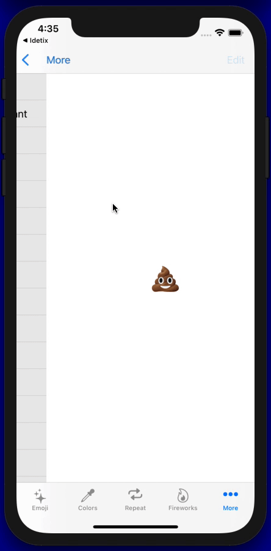

# ConfettiSwiftUI

&nbsp;&nbsp;&nbsp;&nbsp;&nbsp;&nbsp;

### Customizable Confetti Animations in SwiftUI

<p align="center">
  
</p>

## 🌄 Example

<p align="center">
  
  
  
  
</p>

## 🔭 Overview

This is an open-source library to use with SwiftUI. It allows you to create and customize confetti animations.

- Built with pure SwiftUI.
- Select from default confetti shapes or inject emojis as text.
- Configure the radius and angles of the explosion.
- Trigger animation with one state change multiple times.

## 🔨Support 

If you like the project, don't forget to `put star 🌟`.

 <a href="https://brianmacdonald.github.io/Ethonate/address#0xCBa97323b4cA2fF9330827faF306065da7aA338F">
   
 </a>

<!-- <a href="mailto:simibac2@icloud.com"></a>&nbsp;&nbsp;&nbsp;<a href="https://www.linkedin.com/in/simon-bachmann-73b695151/" target="_blank"></a>&nbsp;&nbsp;&nbsp;<a href="https://www.paypal.com/donate?business=6H8D2EDR6LBX6&no_recurring=0&item_name=Thanks+for+supporting+open+source+contributions%21&currency_code=CHF" target="_blank"></a> -->

## 🧭 Navigation

- [💻 Installation](#-installation)
  - [Swift Package Manager](#swift-package-manager)
  - [Manually](#manually)
- [🧳 Requirements](#-requirements)
- [🛠 Usage](#-usage)
  - [Parameters](#parameters)
  - [Configurator Application With Live Preview](#configurator-application-with-live-preview)
  - [Examples](#examples)
- [👨‍💻 Contributors](#-contributors)
- [✍️ Author](#-author)
- [📃 License](#-license)
- [📦 Projects](#-projects)

## 💻 Installation

### Swift Package Manager

The [Swift Package Manager](https://swift.org/package-manager/) is a tool for managing the distribution of Swift code. It’s integrated with the Swift build system to automate the process of downloading, compiling, and linking dependencies.

To integrate `ConfettiSwiftUI` into your Xcode project using Xcode 12, specify it in `File > Swift Packages > Add Package Dependency...`:

```ogdl
https://github.com/simibac/ConfettiSwiftUI.git, :branch="master"
```

---

### Manually

If you prefer not to use any of dependency managers, you can integrate `ConfettiSwiftUI` into your project manually. Put `Sources/ConfettiSwiftUI` folder in your Xcode project. Make sure to enable `Copy items if needed` and `Create groups`.

## 🧳 Requirements

- iOS 14.0+ | macOS 11+
- Swift 5+

## 🛠 Usage

First, add `import ConfettiSwiftUI` on every `swift` file you would like to use `ConfettiSwiftUI`. Define a integer as a state varable which is responsible for triggering the animation. Any change to that variable will span a new animation (increment and decrement).

```swift
import ConfettiSwiftUI
import SwiftUI

struct ContentView: View {
    
    @State private var counter: Int = 0
    
    var body: some View {
        Button("🎉") {
            counter += 1
        }
        .confettiCannon(counter: $counter)
    }
}

```

### Parameters

| parameter          | type           | description                                           | default                                                                                              |
| ------------------ | -------------- | ----------------------------------------------------- | ---------------------------------------------------------------------------------------------------- |
| counter            | Binding<Int>   | on any change of this variable triggers the animation | 0                                                                                                    |
| num                | Int            | amount of confettis                                   | 20                                                                                                   |
| confettis          | [ConfettiType] | list of shapes and text                               | [.shape(.circle), .shape(.triangle), .shape(.square), .shape(.slimRectangle), .shape(.roundedCross)] |
| colors             | [Color]        | list of colors applied to the default shapes          | [.blue, .red, .green, .yellow, .pink, .purple, .orange]                                              |
| confettiSize       | CGFloat        | size that confettis and emojis are scaled to          | 10.0                                                                                                 |
| rainHeight         | CGFloat        | vertical distance that confettis pass                 | 600.0                                                                                                |
| fadesOut           | Bool           | size that confettis and emojis are scaled to          | true                                                                                                 |
| opacity            | Double         | maximum opacity during the animation                  | 1.0                                                                                                  |
| openingAngle       | Angle          | boundary that defines the opening angle in degrees    | Angle.degrees(60)                                                                                    |
| closingAngle       | Angle          | boundary that defines the closing angle in degrees    | Angle.degrees(120)                                                                                   |
| radius             | CGFloat        | explosion radius                                      | 300.0                                                                                                |
| repetitions        | Int            | number of repetitions for the explosion               | 0                                                                                                    |
| repetitionInterval | Double         | duration between the repetitions                      | 1.0                                                                                                  |

### Configurator Application With Live Preview

You can use the configurator app in [demo project here](https://github.com/simibac/ConfettiSwiftUIDemo) to make your desired animation or get inspired by one of the many examples.
  
<p align="center">
   
   
 </p>

### Examples

#### Color and Size Configuration

<p align="center">
  
</p>

```swift
.confettiCannon(counter: $counter, colors: [.red, .black], confettiSize: 20)
```

#### Repeat Configuration

<p align="center">
  
</p>

```swift
.confettiCannon(counter: $counter, repetitions: 3, repetitionInterval: 0.7)
```

#### Firework Configuration

<p align="center">
  
</p>

```swift
.confettiCannon(counter: $counter, num: 50, openingAngle: Angle(degrees: 0), closingAngle: Angle(degrees: 360), radius: 200)
```

#### Emoji Configuration

<p align="center">
  
</p>

```swift
.confettiCannon(counter: $counter, confettis: [.text("❤️"), .text("💙"), .text("💚"), .text("🧡")])
```

#### Endless Configuration

<p align="center">
  
</p>

```swift
.confettiCannon(counter: $counter, num:1, confettis: [.text("💩")], confettiSize: 20, repetitions: 100, repetitionInterval: 0.1)
```

#### Make-it-Rain Configuration

<p align="center">
  
</p>

```swift
.confettiCannon(counter: $counter, num:1, confettis: [.text("💵"), .text("💶"), .text("💷"), .text("💴")], confettiSize: 30, repetitions: 50, repetitionInterval: 0.1)
```

## 👨‍💻 Contributors

All issue reports, feature requests, pull requests and GitHub stars are welcomed and much appreciated.

## ✍️ Author

Simon Bachmann

## 📃 License

`ConfettiSwiftUI` is available under the MIT license. See the [LICENSE](https://github.com/simibac/ConfettiSwiftUI/blob/master/LICENSE) file for more info.

## 📦 Projects

The following projects have integrated ConfettiSwiftUI in their App.

- [Basic Code](https://basiccode.de) available on the [AppStore](https://apps.apple.com/de/app/basiccode/id1562309250)

---

- [Jump Up](#-overview)
